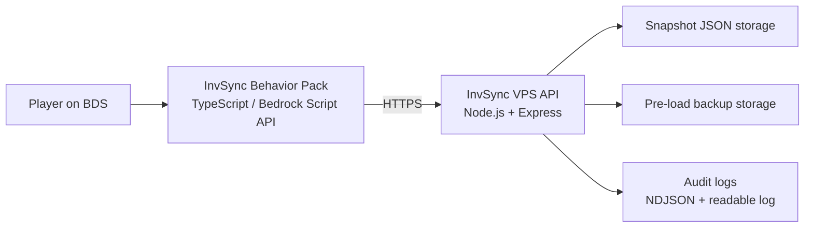

# Inventory Sync

Inventory Sync is an experimental self-hosted inventory transfer system for Minecraft Bedrock Dedicated Server (BDS).
It combines a TypeScript Behavior Pack with a small Node.js API so players can save, move, and restore inventory snapshots across BDS environments while keeping audit logs and basic duplication safeguards.

## Overview

This project was built to make BDS inventory transfer more explicit and easier to operate.
Instead of relying on manual admin work, it separates the problem into two parts:

- a Bedrock Behavior Pack that runs in-game commands and serializes player inventory state
- a self-hosted VPS API that stores snapshots, backups, and readable audit logs

This repository is intentionally small and practical.
It focuses on a working end-to-end flow rather than a large platform.

### What I implemented in this project

- Behavior Pack commands for `save`, `load`, `loadbackup`, `status`, and debugging
- inventory snapshot serialization / restoration logic
- a Node.js API for snapshot storage, backup storage, and audit logging
- duplication prevention rules such as post-save clearing and single-use loads
- BDS bundle generation and deployment-oriented helper scripts

## Problem

On a personal or small-team BDS setup, moving inventory between worlds or server environments is usually awkward:

- server operators have to manage the process manually
- there is little traceability for who saved or loaded data
- restoring the wrong state can overwrite the current inventory
- repeated loads can create duplication risk

Inventory Sync addresses that by making the flow explicit, logged, and self-hosted.

## Architecture



Main runtime pieces:

- `behavior_packs/invsync_bp`
  - BDS-side commands, inventory serialization, and restore logic
- `invsync_vps`
  - HTTPS API that stores snapshots and load history
- `tools/prepare_invsync_bds_pack.ps1`
  - Generates a runtime-only BDS bundle with `permissions.json`

For a more detailed walkthrough, see [docs/architecture.md](docs/architecture.md).

## Features

- Save the current inventory and equipment to a self-hosted API
- Load the latest saved snapshot from another BDS environment using the same API
- Automatically create a pre-load backup before overwriting the current inventory
- Restore the latest automatic backup with `loadbackup`
- Write audit logs for `save`, `load`, `loadbackup`, and pre-load backup events
- Generate a readable log that shows who triggered save/load and from which world
- Clear synchronized slots after `save` to reduce duplication risk
- Mark each saved snapshot as single-use so the same save data cannot be loaded repeatedly
- Leave unsupported portable storage slots untouched instead of pretending they were synced

## Tech Stack

- TypeScript
- Node.js
- Express
- Minecraft Bedrock Script API
- `@minecraft/server-net`
- JSON file storage
- PowerShell deployment helpers
- VPS / HTTPS deployment

## Repository Structure

```text
.
├─ behavior_packs/
│  └─ invsync_bp/              # Bedrock Behavior Pack source
├─ invsync_vps/                # Node.js API for snapshot storage and audit logs
├─ tools/
│  └─ prepare_invsync_bds_pack.ps1
├─ docs/
│  ├─ architecture.md
│  ├─ portfolio-summary.md
│  ├─ release-v0.1.0.md
│  ├─ manual-github-checklist.md
│  └─ github-profile/
└─ CHANGELOG.md
```

## Quick Start

### 1. Prepare the VPS API

```bash
cd invsync_vps
npm install
npm run build
```

Create `.env` from [invsync_vps/.env.example](invsync_vps/.env.example) and set:

- `INVSYNC_API_TOKEN`
- `INVSYNC_DATA_DIR`
- `INVSYNC_BIND_HOST`
- `PORT`

Start the API:

```bash
npm start
```

### 2. Configure the Behavior Pack

Edit [behavior_packs/invsync_bp/scripts/util/config.ts](behavior_packs/invsync_bp/scripts/util/config.ts):

```ts
export const config = {
  namespace: "invsync",
  apiBaseUrl: "https://your-invsync-api.example.com",
  apiToken: "replace-me",
  requestTimeoutMs: 5000,
  serverId: "server-a",
  worldId: "world_a",
  worldName: "World A",
};
```

Then build the pack:

```bash
cd behavior_packs/invsync_bp
npm install
npm run build
```

### 3. Generate a BDS-ready bundle

```powershell
pwsh -File .\tools\prepare_invsync_bds_pack.ps1 -ApiBaseUrl "https://your-invsync-api.example.com"
```

This prepares:

- `bds_ready/invsync_bundle`
- `bds_ready/invsync_bds_bundle.zip`

### 4. Deploy to BDS

- copy `behavior_packs/invsync_bp`
- copy the generated `permissions.json`
- enable the pack on the target world
- restart BDS

## How It Works

### Save flow

1. A player runs `/invsync:inventory save`
2. The Behavior Pack serializes the player's inventory and equipment
3. The VPS stores the snapshot as JSON
4. Audit logs are written
5. The synchronized slots are cleared on the player to reduce duplication risk

### Load flow

1. A player runs `/invsync:inventory load`
2. The current inventory is first backed up automatically
3. The VPS returns the latest snapshot if it has not been consumed yet
4. The Behavior Pack restores the snapshot in-game
5. The load event is written to the audit log
6. The snapshot is marked as consumed so it cannot be loaded again

### Backup restore flow

1. A player runs `/invsync:inventory loadbackup`
2. The latest automatic pre-load backup is fetched
3. The current inventory is backed up again before restore
4. The backup snapshot is restored and audited

## Safety / Duplication Prevention

This repository deliberately includes simple safeguards instead of trying to hide risk:

- Save clears synchronized slots after the snapshot is stored
- A saved snapshot can only be loaded once
- Load creates a backup before overwriting the current inventory
- `loadbackup` restores the latest automatic backup
- Human-readable audit logs make save/load activity easy to inspect
- Unsupported portable storage items are excluded rather than partially synced

## Roadmap

- Add public demo screenshots or short GIFs
- Add a selectable backup history instead of only the latest backup
- Improve visibility for excluded portable storage items in status output
- Re-check support for portable storage items if newer Bedrock Script API builds expose them safely

## Limitations

- Player identity is currently based on `player.name`
- Portable storage items such as shulker boxes are excluded on the current server runtime
- The project assumes a self-hosted HTTPS endpoint that BDS can reach
- Snapshot storage is JSON-file based and intentionally simple
- `loadbackup` currently restores the latest automatic backup, not an arbitrary backup list

## Screenshots / Demo

Public screenshots are not included yet.
The repository already has a placeholder directory for future media: [docs/assets](docs/assets/README.md)

Suggested future assets:

- `docs/assets/inventory-sync-overview.png`
- `docs/assets/inventory-sync-save-load.gif`
- `docs/assets/inventory-sync-audit-log.png`

## Additional Notes

- The BDS-side implementation uses `@minecraft/server` and `@minecraft/server-net`
- The VPS API is a small Node.js + Express service on purpose
- This repository is sanitized for GitHub and does not include real tokens or personal deployment values

Related docs:

- [docs/architecture.md](docs/architecture.md)
- [docs/portfolio-summary.md](docs/portfolio-summary.md)
- [docs/release-v0.1.0.md](docs/release-v0.1.0.md)
- [CHANGELOG.md](CHANGELOG.md)
