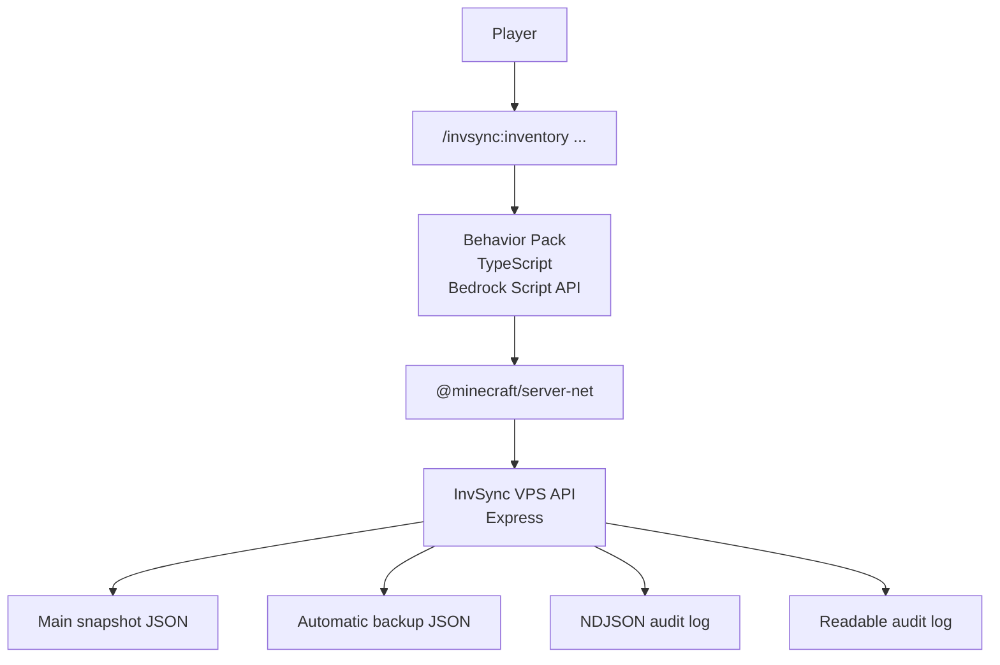
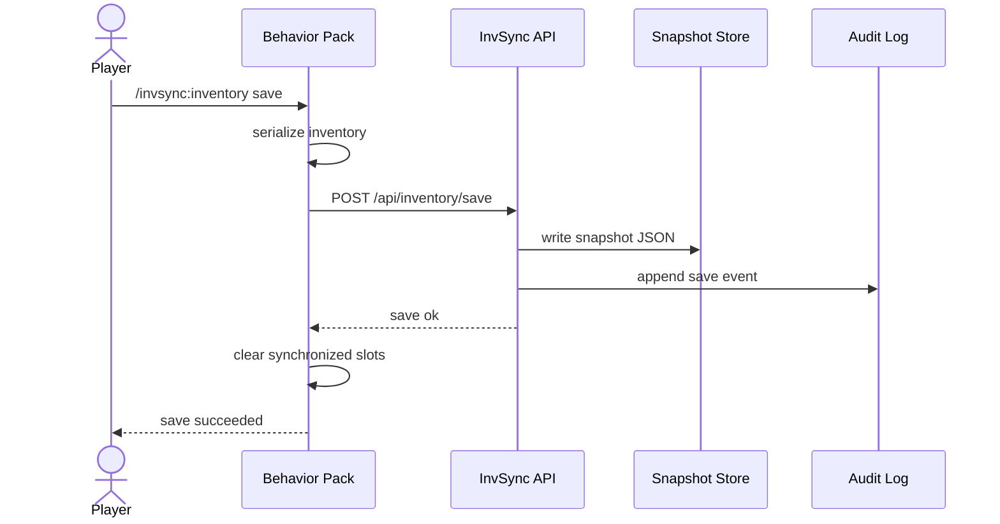
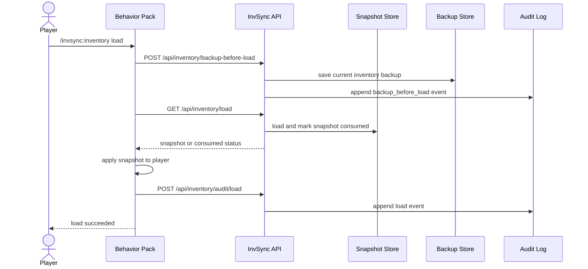

# Architecture

This document explains the Inventory Sync project in slightly more detail than the root README.

## Overview

Inventory Sync is split into two runtime components:

1. A Bedrock Behavior Pack that runs inside BDS and talks to players through commands
2. A self-hosted Node.js API that stores snapshots, backups, and audit logs

The design goal is not a generic cloud service.
It is a small self-hosted system that is understandable and maintainable by one person.

## Component Diagram

## Behavior Pack Side

Main responsibilities:

- resolve player identity
- read inventory and equipment state
- serialize item data into a snapshot object
- call the HTTPS API
- restore snapshots on load
- expose in-game commands for operators and players

Important files:

- `behavior_packs/invsync_bp/scripts/commands/inventoryCommand.ts`
- `behavior_packs/invsync_bp/scripts/inventory/readInventory.ts`
- `behavior_packs/invsync_bp/scripts/inventory/writeInventory.ts`
- `behavior_packs/invsync_bp/scripts/net/apiClient.ts`

## VPS API Side

Main responsibilities:

- receive save and backup requests
- store snapshots on disk
- mark snapshots as consumed after a successful load fetch
- return latest backups
- append structured and human-readable audit logs

Important files:

- `invsync_vps/src/server.ts`
- `invsync_vps/src/store.ts`
- `invsync_vps/src/types.ts`

## Save Sequence

## Load Sequence

## Data Model

Each snapshot stores:

- schema version
- namespace
- identity type and player key
- snapshot id and saved time
- source world metadata
- main inventory slots
- equipment slots
- exclusion metadata for unsupported portable storage

This is intentionally JSON-first.
That makes the stored data easy to inspect during debugging and operation.

## Safety Decisions

The project uses a few explicit safeguards:

- synchronized slots are cleared after save
- each saved snapshot is single-use
- the current inventory is backed up before load
- unsupported portable storage is excluded instead of partially restored
- audit logs are written in machine-readable and readable formats

These safeguards are simple on purpose.
They are easier to explain and operate than hidden automatic behavior.

## Deployment Notes

The repository includes:

- `invsync_vps/deploy/invsync-vps.service`
- `invsync_vps/deploy/Caddyfile.xserver`
- `tools/prepare_invsync_bds_pack.ps1`

These files are examples and templates, not personal production secrets.
You still need to provide your own API URL, token, and BDS-specific metadata.
