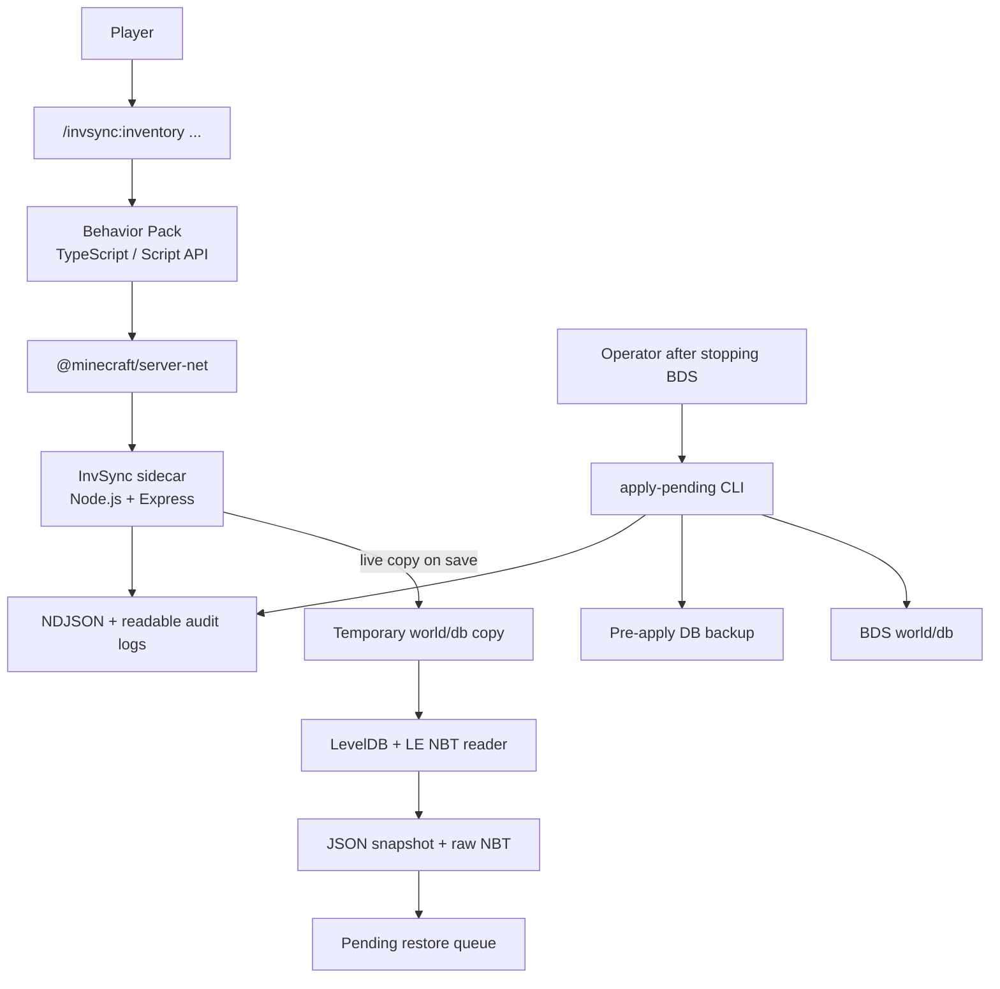
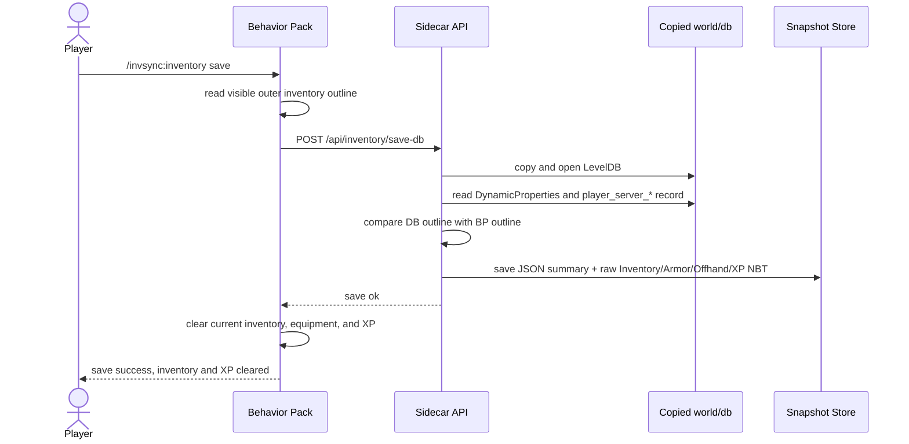
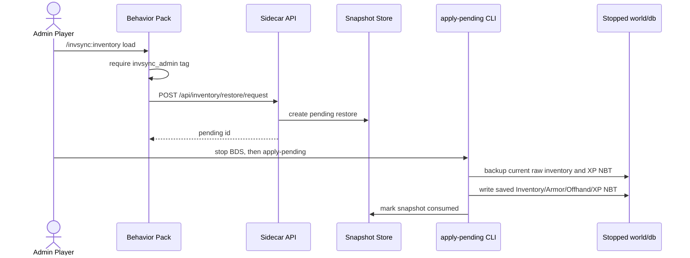
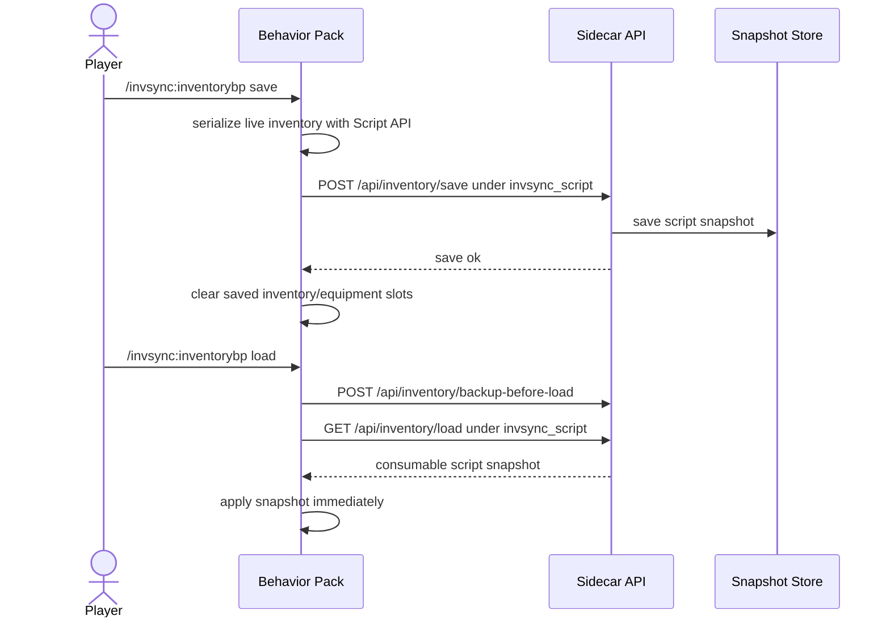

# Architecture

Inventory Sync is split into two runtime components and two inventory modes:

1. A Bedrock Behavior Pack that exposes in-game commands and clears inventory/XP only after save succeeds.
2. A BDS-local Node.js sidecar that reads and writes Bedrock world DB inventory data.
3. DB mode, which stores raw Bedrock inventory NBT and restores it offline.
4. BP/script mode, which stores Script API snapshots and restores them immediately while BDS is running.

The system is intentionally self-hosted. It is designed for small BDS operations where the operator controls both the Behavior Pack and the server host.

## Component Diagram



## Save Flow



The comparison step prevents the most obvious live-copy race: if BDS has not flushed the current inventory to DB yet, the sidecar rejects the save. The Behavior Pack clears the player's current inventory and XP only after the DB-backed save succeeds.

## Restore Flow



Restore is offline by design. The CLI should only run after BDS has stopped using the target world DB.

## BP/Script Immediate Flow



BP/script mode uses the same API storage primitives as the original implementation, but a separate namespace: `invsync_script`. This prevents live Script API snapshots from overwriting DB-backed raw NBT snapshots in `invsync`.

## Data Model

Each DB-backed snapshot stores:

- schema version
- namespace
- identity type and player key
- snapshot id and saved time
- source world metadata
- readable JSON summary of main inventory items
- raw base64-encoded NBT entries for `Inventory`, `Armor`, `Offhand`, and XP-related player tags
- optional restore pending metadata
- optional consumed timestamp

## Important Files

- `behavior_packs/invsync_bp/scripts/commands/inventoryCommand.ts`
- `behavior_packs/invsync_bp/scripts/inventory/readInventory.ts`
- `behavior_packs/invsync_bp/scripts/inventory/writeInventory.ts`
- `invsync_vps/src/dbInventory.ts`
- `invsync_vps/src/bedrockNbt.ts`
- `invsync_vps/src/cli.ts`
- `invsync_vps/src/store.ts`
- `invsync_vps/src/server.ts`

## Safety Decisions

- `save` clears the player's current inventory and XP only after the DB-backed snapshot is stored successfully.
- `save-db` rejects obvious DB/live inventory mismatches.
- `load` and `loadbackup` only create pending restores.
- Restore reservations require the configured admin tag.
- Offline apply creates a pre-apply backup before writing DB data.
- A snapshot is marked consumed only after the DB write succeeds.
- Audit logs are written in machine-readable and readable formats.
- DB mode and BP/script mode use separate namespaces.
- BP/script mode does not require a BDS stop, but it only restores what Bedrock Script API can serialize.
- BP/script `savebp` leaves unreadable portable storage uncleared to avoid deleting contents that were not captured.
- BP/script mode does not clear or restore XP; DB mode remains the XP-sharing path.

## Deployment Notes

The sidecar should run on the same host as BDS or with local filesystem access to the world `db` directory. A typical resource-server DB path looks like:

```text
/srv/bds/resource/worlds/Bedrock level_new/db
```

FTP and SSH DB sources are supported for migration scenarios, but local filesystem access is the safest production setup.
